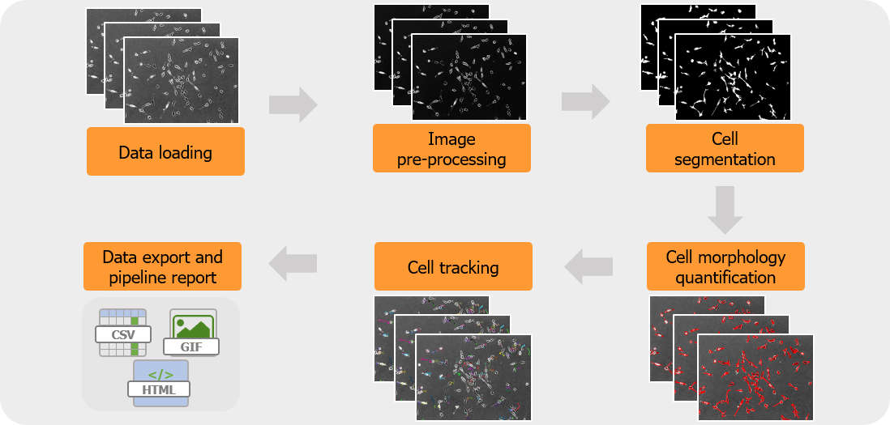

## CellMojo

### What is CellMojo?
CellMojo is an open-source and free Python toolbox developed to address key image processing tasks in **cell migration** research.

The toolbox is composed of distinct modules that take care of:

- image pre-processing
- cell segmentation
- cell morphology quantification
- cell tracking

These key functionalities are depicted in a typical **CellMojo analysis pipeline** in **Figure 1**.

**Figure 1**: A typical CellMojo analysis pipeline.

### How can I use CellMojo?
A full tutorial on CellMojo is available [at this page](doc/manual.md).

### How can I contribute to CellMojo?
We believe in collaborative efforts to make our toolbox even more comprehensive and useful for the community. If you want to contribute to CellMojo development, here are three ways:

- If you find a bug or you would like to see enhancement in the software, open an issue on the issues GitHub page.
- If you wish to modify the toolbox yourself, fork this repository and make a pull request. We look forward to receiving new features and additions to CellMojo.

### How can I cite CellMojo?
A scientific manuscript describing CellMojo is currently *in preparation*.
